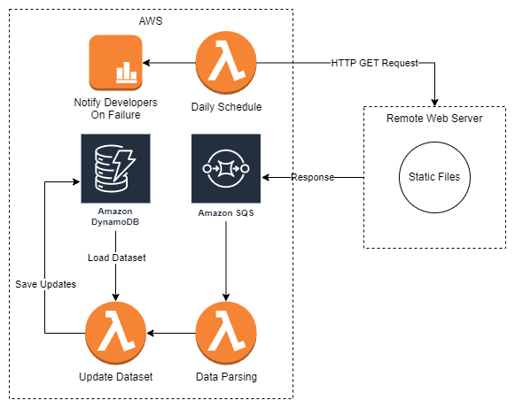

# Question 2

## Advantages of the Solution

- Automation. As the solution is automated and designed to run on a daily schedule, there will be a reduced need for manual intervention.

- Scalability. Storing updates in cloud storage provides scalability. AWS can handle increasing data volumes.

- Notifications on Failure. In case of failure, we notify developers. This mechanism would speed up issue resolution and avoid further problems.

- Ease of Implementation. The solution would be simple to implement, as AWS Lambda is a serverless computing service.

## Disadvantages of the Solution

- Resource Usage. With frequent HTTP requests, data processing, and storage operations, our solution will consume AWS resources. Therefore, there will be regular operational costs.

- Notification Overhead. If there are frequent notifications for minor issues, developers may become overwhelmed with a high volume of alerts.

- Data Privacy and Security. There will be data privacy and security concerns, as we are using a third-party platform to store sensitive data in the cloud.

- Dependency on External Sources. Our solution relies on the availability and consistency of external update files, which could be a potential point of failure.

- Error Handling. We need robust error handling for various scenarios to ensure data integrity and reliability.
